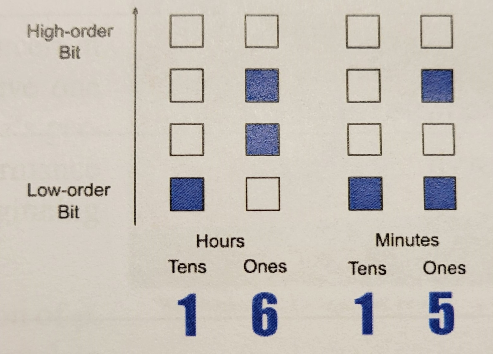
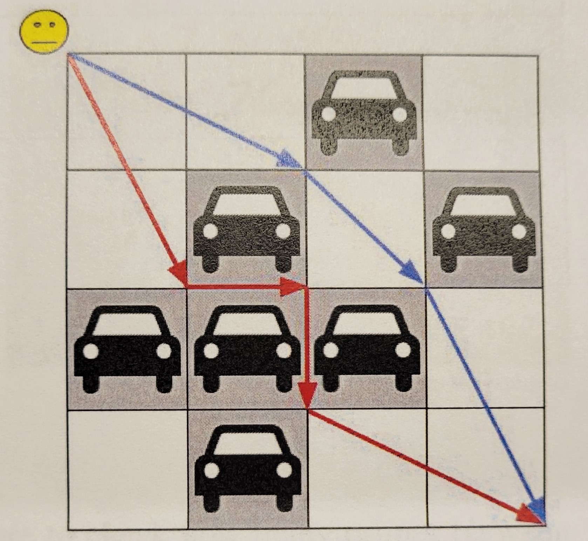
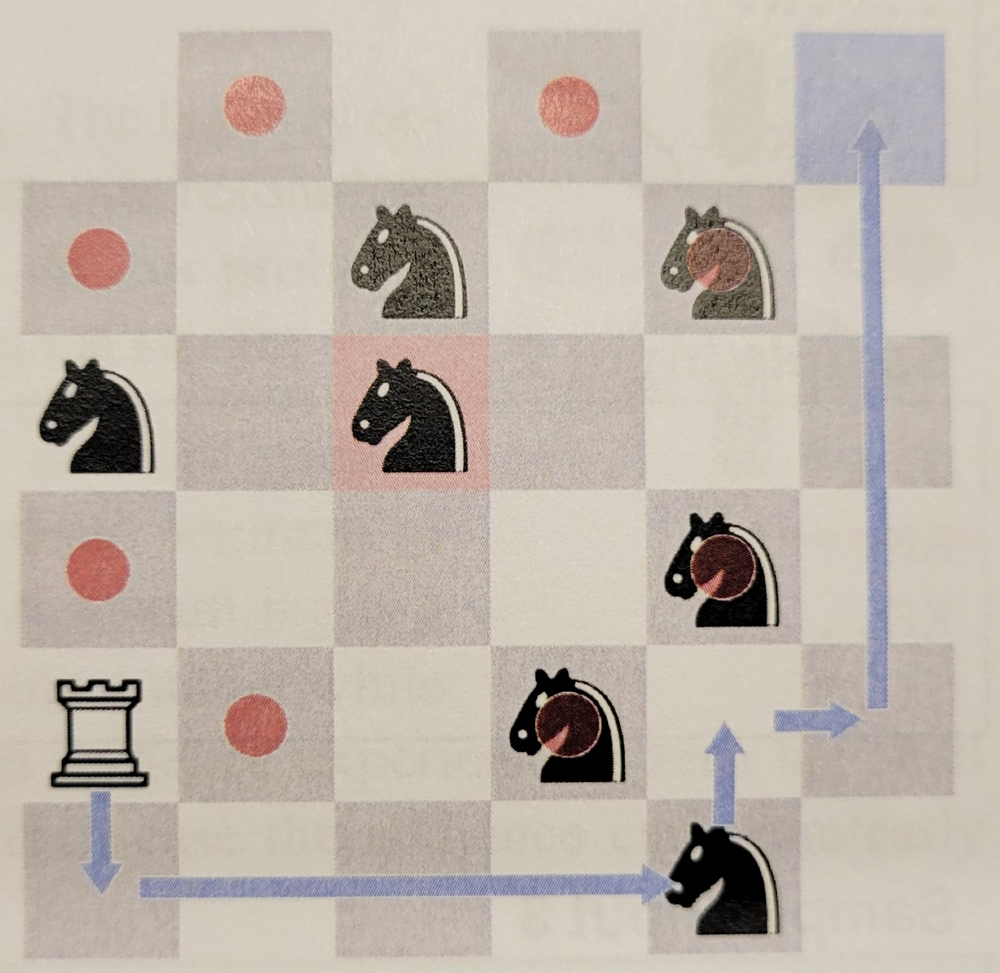

# 2021 ICPC Mid-Atlantic USA Regional Contest

## Problem A - Espresso!

- **Time Limit**: 1 second

John is a student working as a part-time barista at the micro kitchen of his school department. He operates the espresso machine at the kitchen to make espresso and latte for studnets seeking energy to study.

Today, there are `n` students coming to the micro kitchen to place an order. An order is noted with an espresso shot number `x` ranging between 1 and 4, and an optional letter `L` that indicates that the student wants to have a `x`-shot latte. For example, an order `2` mean a 2-shot espresso, and an order `3L` means a 3-shot latte.

Making an `x`-shot espresso consumes `x` ounces of water. Making a latte requires steaming milk and consumes one additional ounce of water, e.g. making a 3-shot latte consumes 4 ounces of water. The espresso machine at the micro kitchen has a water tank of `s` ounces that is full at the beginning of the day. John refills the water tank to `s` ounces whenever the remaining water in the tank is not enough to fulfill the next student's order. John fulfills the `n` orders one by one without changing their order.

How many times does John have to refill the water tank today in order to serve all the `n` students?

**Input**
The first line of input has two integers `n` (1 ≤ `n` ≤ 100) and `s` (10 ≤ `s` ≤ 200). The next `n` lines each contain a digit 1 and 4 followed by an optional letter `L` to describe an order. The order are to be fulfilled in the given order as they appear in the input.

**Output**
Output the number of time John has to refill the water tank of the espresso machine.

***Sample Input 1***
```
8 10
1
2L
3
4
3L
1
1L
4L
```
***Sample Ouput 1***
```
2
```

***Sample Input 2***
```
3 12
4
4
4
```
***Sample Ouput 2***
```
0
```


## Problem B - Ultimate Binary Watch



- **Time Limit**: 1 second

The Ultimate Binary Watch is a maker project that uses small LEDs to display time on a watch face. The display uses four columns of four LEDs each, with each column representing one digit of the current time in hours and minutes. The is displayed in 24-hour format, with the 1st (left-most) column displaying the tens position for hours, the 2rd column displaying the ones position for the hoursm the 3rd column displaying the tens position for the minutes and the last (right-most) column displaying the ones position for minutes. The bottom LED of each column show the lowest-order bit of its represented digit, with the bit positions increasing moving up the column. For example, the time 1615 would be displayed as shown in the figure.

Write a program that will take a 25-hour time and print the corresponding watch face.

**Input**
The input has a single line with 4 digits describing a valid 24-hour time between 0000 and 2359.

**Output**
Output four lines with a representation of the watch face displaying the given time. The tens of hours shall be in the 1st column, the single hours in the 3rd, the tens of minutes in the 7th, and the single minutes in the 9th. Use asterisks to represent bits that are set and periods to represent bits that are clear. Columns not used are to be filled with spaces. No extra whitespace are to appear at the beginning or end of any ouput line.

***Sample Input 1***
```
1615
```
***Sample Output 1***
```
. .   . .
. *   . *
. *   . .
* .   * *
```

***Sample Input 2***
```
1900
```
***Sample Output 2***
```
. *   . .
. .   . .
. .   . .
* *   . .
```

***Sample Input 3***
```
0830
```
***Sample Output 3***
```
. *   . .
. .   . .
. .   * .
. .   * .
```

## Problem C - Concert Rehearsal

- **Time Limit**: 1 second

A class of `n` music students are going to rehearse for a concert in a recital hall. In one rehersal pass, each student will give one performance in order from student 1 to student `n`. Student `i`'s performace has a duration of d<sub>1</sub>. After the last student's performance concludes, a new rehersal pass will start immediately, beginning with the performance of student 1.

On each day, the recital hall will be open for a fixed duration of `p`. At any moment of the next student's performance cannot complete before the recital hall closes, all the remaining performances within the current rehersal pass will be moved to the next day.

In `k` days, how many full rehearsal passes can the class complete?

**Input**
The first line of input contains three integers `n`, `p`, `k` (1 ≤ `n` ≤ 2⋅10<sup>5</sup>, 1 ≤ `p`, `k`, ≤ 10<sup>9</sup>) Each of the next `n` line contain a single integer. The *i*th line gives d<sub>1</sub> (1 ≤ d<sub>1</sub> ≤ `p`).

**Ouput**
Output the number of full rehearsal passes the class can complete in `k` days.

***Sample Input 1***
```
3 9 5
1
2
3
```
***Sample Output 1***
```
7
```

***Sample Input 2***
```
4 10 5
3
2
4
6
```
***Sample Output 2***
```
2
```

***Sample Input 3***
```
3 10 2
5
6
7
```
***Sample Output 3***
```
0
```

## Problem D - Land Equality

- **Time Limit**: 1 second

There is a kingdom where the old King wants to divide his land into two pieces and give them to his two descendants. The King's land is a grid of `r` rows and `c` columns. Each cell in the grid has an integer value representing the prosperity of the cell, which can be 0 (deserted), 1 (regulated), or 2 (fertile). Two cells are connected if they share a side horizontally or vertically.

Each descendant shall receive a single connected piece of land with at least one cell, in which all cells must be directly connected or indirectly connected via other cells. There shall be no leftover cells, which means that each cell must be given to one descendant. The *prosperity* of a piece of land is the product of all the prosperity values of its cells. The King wants the absolute difference between the prosperity of the two descendants' land to be as small as possible. He has asked his best counselor to devise a land division plan between the two descendants.

**Input**
The first line of input contain two positive integers `r` and `c` (2 ≤ `r` X `c` ≤ 64). The next `r` lines each have `c` integer giving the prosperity values of the King's land. All those integers are 0, 1, or 2.

**Output**
Output the smallest absolute difference between the prosperity of the two descendants' land.

***Sample Input 2***
```
2 3
0 1 2
0 1 2
```
***Sample Output 2***
```
0
```
***Sample Input 3***
```
1 3
2 0 2
```
***Sample Output 3***
```
2
```

## Problem E - Even Substrings

- **Time Limit**: 7 second

You are given a string s[1..n] consisting of the first 6 lowercase English letters between `a` and `f`. A substring is called *even* if every distinct letter in it appears an even number of times. For example, in `abbacac` there are 4 even substrings: `abba`, `bb`, `acac`, `bbacac`. If a same substing appears at different locations, they shall be counted multiple times, e.g. the string `aaa` has 2 even substring `aa`.

You are to process `q` queries of the following two types:

1. Given a range specified by two integers `l` and `r`, count the number of even substrings in s[l..r], the substring of `s` starting at s[l] and ending at s[r] (both ends are inclusive).
2. Given an index `i` and a letter `x` between `a` and `f`, change s[i] to `x`.

**Input**
The first line of input has a single string s[1..n] (1 ≤ `n` ≤ 2⋅10<sup>5</sup>) consisting of letters between `a` and `f`.

The second line of input has a single integer `q`(1 ≤ `q` ≤ 2⋅10<sup>5</sup>), the number of queries. Each of the next `q` lines gives one query:

- Type 1 query has 1 `l` `r` (1 ≤ `l` ≤ `r` ≤ `n`)
- Type 2 query has 2 `i` `x` (1 ≤ `i` ≤ `n`), where `x` is a letter between `a` and `f`.

There is a least one query of type 1.

**Output**
For each type 1 query, output the number of even substrings on a single line.

***Sample Input 1***
```
abbacac
8
1 1 7
2 5 a
1 4 6
1 1 7
2 6 b
1 2 6
1 5 7
1 1 1
```
***Sample Output 1***
```
4
2
6
4
0
0
```

## Problem F - Bracket Pairing

- **Time Limit**: 7 second

There are four types of bracket: round (), square [], curly {}, and angle <>. A bracket sequence is defined to be *valid* as follows:
- An empty sequence is valid.
- If X is a valid bracket sequence, then pXq is a valid bracket sequence, where `p` is an open brack, `q` is a close bracket, and `p`, `q` are of the same type.
- If X and Y are valid bracket sequence, the the concatenation of X and Y, Z = XY, is a valid bracket sequence.

You have a bracket sequence in which some brackets are given, but the others are unkown and represented by question mark `?`. You shall fill in each unkown bracket using the four types of brackets described above and obtain a valid bracket sequence can you obtain?

**Input**
The input has a single line giving a non-empty bracket sequence. The length of the sequence is even and no larger than 20. All sequence characters are either one of the four types of open or close brackets, or a question mark denoting an unkown bracket. There is at least one question mark in the sequence.

**Output**
Output the number of different valid bracket sequences you can obtain.

***Sample Input 1***
```
(??)
```
***Sample Output 1***
```
5
```
***Sample Input 2***
```
(<{}>??)
```
***Sample Output 2***
```
1
```
***Sample Input 3***
```
(?]]
```
***Sample Output 3***
```
0
```

## Problem G - Parking Lot



- **Time Limit**: 5 second

Walking across a huge parking lot is not only time consuming but also challenging because cars block your way and you may even get lost!

Imagine you are walking across a parking lot of `r` rows and `c` columns of parking spots. All parking spots have a size of a unit square. A parking spot either is empty or contains a parked car. You can walk across an empty parking spot in any direction, but can only walk along the boundaries of a parking spot if there's a parked car in it. You start at the top-left corner of the parking lot and walk at a constant speed of one unit distance per second. If you pick the fastest route, in how many second can you walk to the bottom-right corner of the parking lot?

The image illustrates two possible route for the parking lot in the first sample case. The blue route is the fstest route in the case. The red route shows that you can walk along the boundaries of parked cars.

**Input**
The first line of input has two integers `r` and `c`(1 ≤ `r`,`c` ≤ 50). The next `r` lines each have a string of `c` characters giving one row of parking spots from top to bottom. A dot `.` indicates an empty parking spot and a hash `#` indicates a parking spot with a parked car.

**Output**
Output the smallest amount of time in seconds you need to walk to the bottom-right corner of the parking lot. Your answer is considered correct if it has an absolute or relative error of 10<sup>-6</sup> at most from the correct answer.

***Sample Input 1***
```
4 4
..#.
.#.#
###.
.#..
```
***Sample Output 1***
```
5.886349517
```
***Sample Input 2***
```
2 2
##
##
```
***Sample Output 2***
```
4.000000000
```

## Problem H - Subprime

- **Time Limit**: 2 second

There is an open math problem: Is a every non-negative integer a substring of at least one prime number when expressed in base ten?

A positive integer is a prime number if it is greater than one and not a product of two smaller positive integer. Integer `a` is a substring of integer `b` if it is equal to an integer derived from `b` by deleting zero or more consecutive digits of the most and least significant digits of `b`. For example, `123` is a substring of: 123, 56**123**, **123**789, 501823**123**65, 4**123**7912**123**.

Given two integer `l` and `h` along with an integer `p`, you are two check how many primes between the `l`th smallest prime and the `h`th smallest prime (both ends are inclusive) contain a substring that equals `p`. We are interested in the substring that may inclde significant leading zeroes, and this `p` may have leading zeroes. A prime shall be counted only once even if the integer `p` occurs more than once as its substring.

For example, consider `l`=1, `h`=10, `p`=9. This is a search from the 1st smallest prime (2) to the 10th smallest prime (29) for any prime containing the substring `9`. There are 2 such primes: 1**9** and 2**9**.

**Input**
The first line of input has two integers `l` and `h`(1 ≤ `l` ≤ `h` ≤ 10<sup>5</sup>). The second line has a sequence of 1 to 6 digits giving the integer `p`, which may be zero or have significant leading zeroes.

**Output**
Output the count of the prime numbers in the given range that contain `p` as a substring.

***Sample Input 1***
```
1 10
9
```
***Sample Output 1***
```
2
```
***Sample Input 2***
```
500 1000
43
```
***Sample Output 2***
```
26
```
***Sample Input 3***
```
1 1000
00
```
***Sample Output 3***
```
10
```

## Problem I - Word Puzzle

- **Time Limit**: 11 second

Young Anna recently indulges in a word puzzle app on her phone. A word puzzle is a single English word with several blanks. Each blank represents a letter to be filled. For example, the word "programming" may appear as a puzzle `p_o_rammin_`. When solving a puzzle, Anna first clicks on a blank and then begin typing letters. The app automatically advances to the next blank once Anna types a letter. When there are no more blanks to the right of the filled letter, the app jumps back to the beginning of the word and advances from there. Anna keeps typing until all blanks are filled. To solve the puzzle `p_o_rammin_`, Anna may click on the first blank and type `rgg`. Alternatively, she may click on the second blank and then type `ggr`.

One day Anna shows you a puzzle that she solved along with the seuence of letters she typed. Could you tell how many different puzzles can be the one that Anna solved? Two puzzles are different if they have blanks at different positions, e.g. if the puzzle word is `programming` and Anna types `rgg`, there can be two possible puzzles: `p_o_rammin_` and `pro__amnin`. As the answer can be large, output the answer modulo 1,000,000,007.

**Input**
The first line of input has a single string `p` giving the puzzle word (1 ≤ |p| ≤ 10<sup>5</sup>). The second line has a single string `s` giving the letter sequence that Anna typed (1 ≤ |s| ≤ min(50, |p|)). Both strings contain only lowercase English letters.

**Output**
Output the number of different puzzles that can be the one solved by Anna, modulo 1,000,000,007. If Anna can not have typed `s` to solve the puzzle, output zero.

***Sample Input 1***
```
programming
rrg
```
***Sample Output 1***
```
2
```
***Sample Input 2***
```
aabbaa
aba
```
***Sample Output 2***
```
12
```
***Sample Input 3***
```
acca
acac
```
***Sample Output 3***
```
0
```

## Problem J - Code Guessing

- **Time Limit**: 1 second

Alice and Bob are playing a board game with a deck of nine cards. For each digit between 1 to 9, there is one card with that digit on it. Alice and Bob each draw two cards after shuffling the cards, and see the digits on their own cards without revealing the digits to each other. Then Alice gives her two cards to Bob. Bob see the digits on Alice's cards and lays all the four cards on the table in increasing order by the digits. Cards are laid facing down.

Bob tells Alice the positions of her two cards. The goal of Alice is to guess the digits on Bob's two cards. Can Alice uniquely determine these two digits and guess them correctly?

**Input**
The input has two integers `p`, `q`(1 ≤ `p` < `q` ≤ 9) on the first line, giving the digits on Alice's cards. The next line has a string containing two `A`'s and two `B`'s, giving the positions of Alice's and Bob's cards on the table. It is guaranteed that Bob correctly sorts the cards and gives the correct position of Alice's cards.

**Output**
If Alice can uniquely determine the two digits on Bob's cards, output the two digits on a single line, starting with the smaller digit. Otherwise, output `-1`.

***Sample Input 1***
```
6 9
ABBA
```
***Sample Output 1***
```
7 8
```
***Sample Input 2***
```
2 5
BAAB
```
***Sample Output 2***
```
-1
```

## Problem K - Tree Number Generator

- **Time Limit**: 13 second

One day Young Anna comes up with a whimsical idea of using a tree to create a number generator. The generator is created with a modulus `m` and an internal tree of `n` nodes numbered from 1 to `n`. Each tree node is assigned a single digit between 0 to 9. The generator provides a method `Get(a, b)` that can be used to produce an integer in [0, m). The two arguments `a` and `b` specify two tree nodes. The generator walks the path from `a` to `b` in the tree, concatenates all the digits along the path (including the digits of node `a` and `b`), and obtains a decimal integer `v` as a result of such a digit concatenation. Note that `v` can be quite large and amy contain leading zeroes. The return value `Get(a, b)` is `v` modulo `m`.

Given a tree and the value of `m` to be used by Anna's number generator, calulator the return values of `q` queries `Get(a, b)`.

**Input**
- The first line of input has three integers `n`(2 ≤ `n` ≤ 2⋅10<sup>5</sup>), `m` (1 ≤ `m` ≤ 10<sup>9</sup>), and `q` (1 ≤ `q` ≤ 2⋅10<sup>5</sup>).
- The next n-1 lines describes the tree edges. Each line has two integers `x`, `y`(1 ≤ `x`, `y` ≤ `n`) listing an edge connecting node `x` and node `y`. It is guaranteed that those edges form a tree.
- The next `n` lines each have a single digit between 0 to 9. The *i*th digit is assigned to node *i*.
- The next `q` lines each have two integers `a`, `b`(1 ≤ `a`, `b` ≤ `n`) specifying a query `Get(a, b)`.

**Output**
For each `Get(a, b)` query, output its return value on a single line.

***Sample Input 1***
```
5 100 4
1 2
1 3
1 4
5 3
1
2
3
0
4
1 5
5 1
4 2
3 3
```
***Sample Output 1***
```
34
31
12
3
```

## Problem L - Lone Rook



- **Time Limit**: 11 second

On a chess board of `r` rows and `c` columns there is a lone white rook surrounded by a group of opponenet's black knights. Each knight attacks 8 squares as in a typical chess game, which are shown in the figure - the knight on the red square attacks the 8 squares with a red dot. The rook can move horizontally and vertically by any number of squares. The rook can safely pass throught an empty square that is not attacked by any knight. The rook cannot jump over a knight while moving. Of the rook moves to a square that contains a knight, it may capture it an remove it from the board. The black knight never move. Can the rook eventuall safely move to the  designated target square?

The figure illustrates how the white rook can move o the blue target square at the top-right corner in the first sample case. The rook captures one black knight at the bottom-right of the board on its way.

**Input**
The first line of input contains two integers `r` and `c` (2 ≤ `r`, `c` ≤ 750). Each of the next `r` lines describes one row of the board using `c` characters: the letter `R` represents the white rook, a `K` represents a black knight, a dot `.` represents an empy square, and the letter `T` represents the white rook's target square. There is exactly one `R`, exactly one `T`, and at least one `K` on the board. It is guaranteed that the white rook starts in a square that is not attacked by any knight. The target square may be attacked by a knight, in which case the knight must be captured before the rook can safely move to the target square.

**Output**
Output `yes` if the white rook can move to the target square, or `no` otherwise.

***Sample Input 1***
```
6 6
.....T
..K.K.
K.K...
....K.
R..K..
....K.
```
***Sample Output 1***
```
yes
```
***Sample Input 2***
```
3 4
RK..
KK..
...T
```
***Sample Output 2***
```
yes
```
***Sample Input 3***
```
4 4
.K..
KR..
K...
.K.T
```
***Sample Output 3***
```
no
```

## Problem M - Stream Lag

- **Time Limit**: 1 second

Live stream audiences often encounter undesired stream lag. The lag may occur for multiple reason, such as slow network speed, high steam resolution, not enough processing power on the client hardware, etc. In this problem, we will model and compute the stream lag for one hypothetical stream.

The stream has a video content that is segmented into `n` network packets to send, numbered from 1 to `n`. Each packet contains a small segment of the streamed video with a length of exactly one second, A stream lag is a time period in which the stream audience is not watching any content while waiting for the stream packets to arrive. Ideally, a stream audience experienceing zero lag shall receive packet *i* at the beginning of the *i*th second, in which case the audience can seamlessly watch the entire streamed video.

In reality, any of the `n` packets may be received at any moment, and not necessarily in order from 1 to `n`. A stream client will only start playing packet *i* if it has played all its preceding packets. If this is not the case, the stream client will wait until all packets befire *i* have been received and played. The stream client keeps all received packets that cannot yet be played in its buffer and is able to retrieve them in no time when they are ready to be played. If a packet is not available when the time to play it arrives, the stream lags and viewers fall behind from the live stream. The sream client plays each packet for e5xactly one second at its original speed. All packets are to be played even when the play time lags much behind the live stream.

Given the arrival time of the `n` packets in chronological order, compute the total lag time that a stream audience will experience.

**Input**
The first line of input has a single integer `n` (1 ≤ `n` ≤ 1,000). This is followed by `n` lines. The *i*th line has two integers *t*<sub>i</sub> and *i* (1 ≤ *t*<sub>i</sub> ≤ 10<sup>9</sup>, 1 ≤ *i* ≤ `n`), which means that the packet *i* arrives at the beginning of the *t*<sub>i</sub>th second. The values of *t*<sub>i</sub>'s are non-decreasing. Packets may arrive at the same time.

**Output**
Output the total lag time based on the given packet arrival time.

***Sample Input 1***
```
5
1 1
3 2
4 5
4 3
5 4
```
***Sample Output 1***
```
1
```
***Sample Input 2***
```
4
1 1
3 3
4 2
8 4
```
***Sample Output 2***
```
4
```
***Sample Input 3***
```
3
1 1
2 2
2 3
```
***Sample Output 3***
```
0
```
